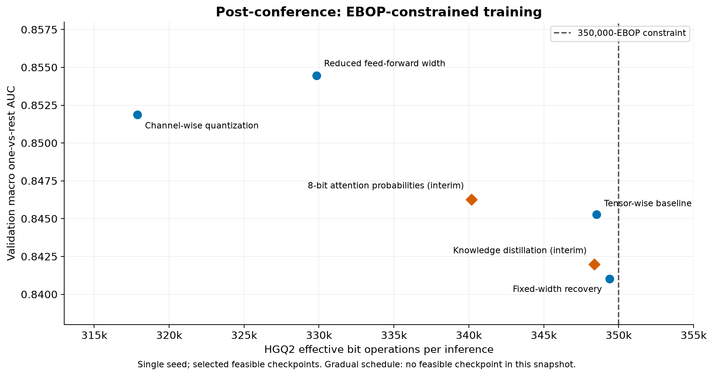
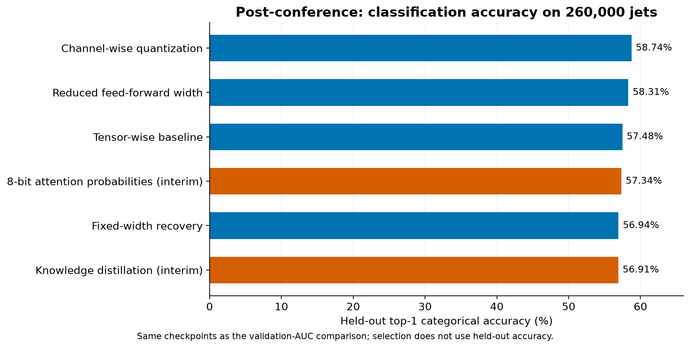
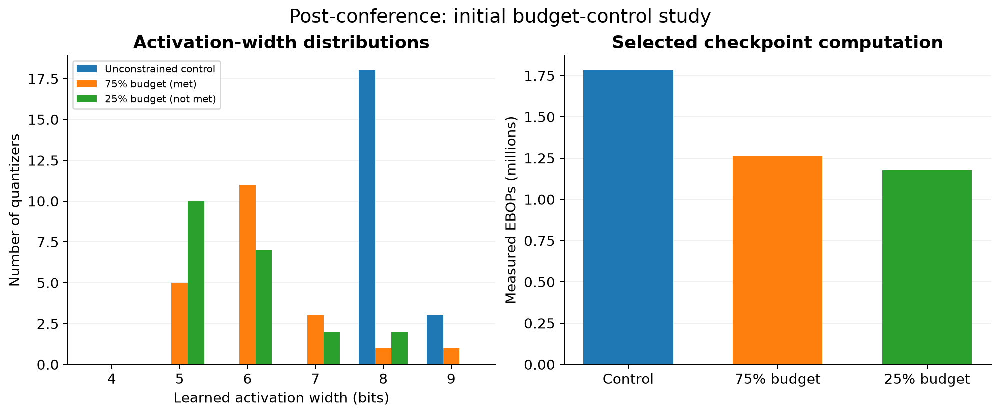
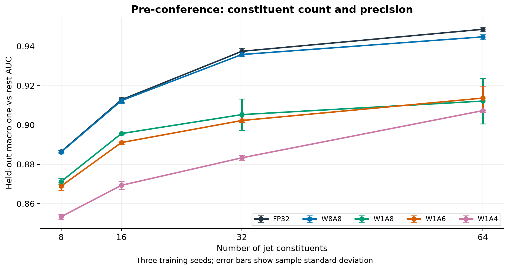
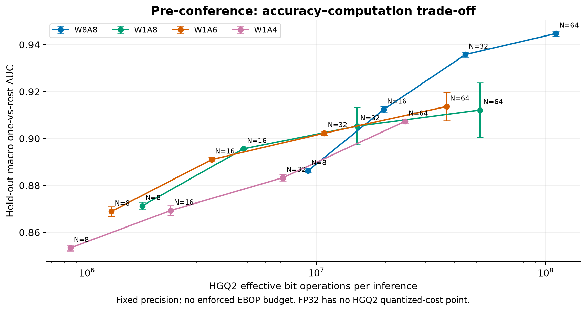
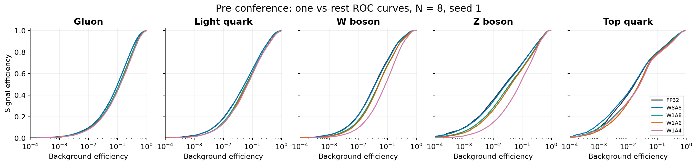
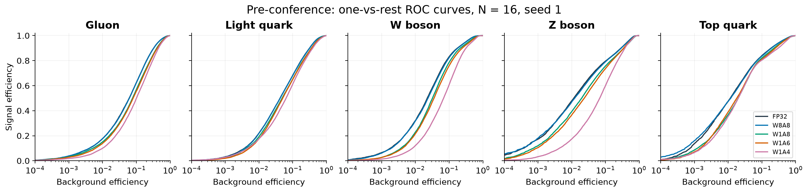
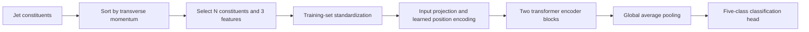
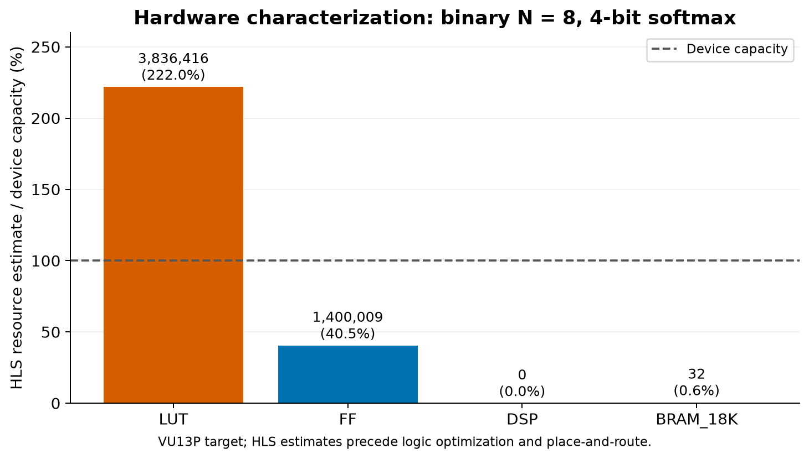

# Binary Transformer Jet Tagging

**Binary-weight transformers for five-class jet classification, with heterogeneous activation quantization and explicit computational budgets.**

This repository contains the model implementation, training and evaluation scripts, experiment configurations, numerical results, and reproducible figures. The study examines how weight precision, activation precision, constituent count, and effective bit-operation constraints affect classification performance and FPGA resource requirements.

[Recent results](#research-update--september-2026) · [Pre-conference study](#pre-conference-fixed-precision-study) · [Methods](#model-and-evaluation) · [Reproduction](#reproduce-the-results) · [Code](#repository-structure)

## What I’m working on now

**[Full-run confirmation campaign](docs/current-work/CONFIRMATION_RUNS_20260924.md)** · [Complete experiment index](docs/current-work/EXPERIMENT_INDEX_20260923.md) · [Current-work hub](docs/current-work/README.md)

**September 24 confirmation update:** A02 and A11 held-out checkpoint evaluation is deterministic across independent reloads. A02 records **60.7850% held-out accuracy and 0.860432 macro-OvR AUC** at 349,298 eBOPs; A11 records **62.3335% and 0.873813** at its separate 479,462-eBOP point. Twelve seed-confirmation runs—six N8 and six N64—are now running under full 1,000-epoch schedules with no intermediate promotion gate. Three processes share one GPU and have measured 99–100% utilization.

**September 23 final status:** all 27 architecture/attention runs reached 1,000 epochs. Five architecture runs have checkpoints within their configured budgets. A02 is the leading 350k candidate at **61.08% internal-validation accuracy and 349,298 EBOPs**; A11 reaches **62.62% at 479,462 EBOPs** under its separate 500k target. **None of the 15 attention runs found a checkpoint within 350k.** See the **[final results and limitations](docs/current-work/TRAINING_RESULTS_20260923.md)** and **[machine-readable snapshot](docs/current-work/training-results-20260923.json)**.

[Live training curves](https://wandb.ai/kayamaguchi-uc-san-diego/BNJetTag-Batch20260917) · [Full batch plan](docs/current-work/TRAINING_BATCH_PLAN_WITH_FROZEN_BACKBONE_FOLLOWUP.md) · [Final run snapshot](docs/current-work/training-results-20260923.json)

**Engram studies:** all four original E00–E03 training loops reached 1,000 epochs. E00 passed the outer runner; E01–E03 failed selected-checkpoint metric reproduction, and none found a feasible checkpoint under the augmented 350k target. A separate [matched N8/N64 exploratory screen](docs/current-work/CONSTITUENT_SCREEN_20260923.md) completed 28 of 38 intended cases at 50 epochs; it found an interesting N64 memory signal but no feasible checkpoint. Exact source and configurations for that screen are frozen under [`code/constituent-study-20260922`](code/constituent-study-20260922/README.md).

The complete index maps all **86 W&B records** across the three September projects, including every trained N64 row, all original and fresh Engram variants, diagnostic attempts, the statically rejected E07/N64 case, and the separate pre-conference N64 baseline.

## Research update — September 2026

### Post-conference: EBOP-constrained training

The current study enforces a **350,000 effective bit-operation (EBOP) ceiling** when selecting checkpoints. It compares tensor-wise and channel-wise quantization, feed-forward width, attention-probability precision, budget scheduling, fixed-width recovery, and knowledge distillation. The training schedule is 1,000 epochs with matched data splits and initialization where tensor shapes permit.

<!-- BEGIN RECENT_RESULTS -->

Evaluation snapshot: **2026-09-16**. All experiments use eight constituents and one training seed.

| Experiment | EBOPs | Validation AUC | Held-out accuracy | Status |
|---|---:|---:|---:|---|
| Tensor-wise baseline | 348,526 | 0.8453 | 57.48% | Completed |
| Channel-wise quantization | 317,890 | 0.8519 | 58.74% | Completed |
| Reduced feed-forward width (32) | 329,838 | 0.8545 | 58.31% | Completed |
| 8-bit attention probabilities | 340,174 | 0.8463 | 57.34% | Completed |
| Gradual budget schedule | 349,550 | 0.8477 | 57.51% | Completed |
| Fixed-width recovery | 349,390 | 0.8410 | 56.94% | Completed |
| Knowledge distillation | 348,366 | 0.8420 | 56.91% | Completed |

<!-- END RECENT_RESULTS -->

The reduced feed-forward model has the highest recorded **validation AUC** among these feasible checkpoints. Channel-wise quantization has the highest recorded **held-out categorical accuracy**. These are different metrics: AUC evaluates score ranking, while categorical accuracy evaluates the largest predicted class score. Each checkpoint is selected using validation AUC under the EBOP ceiling; held-out accuracy does not enter selection.



*Validation AUC uses 124,000 jets from the training archive. All seven selected checkpoints meet the 350,000-EBOP ceiling.*



*Held-out accuracy uses all 260,000 jets in the separate validation archive. These single-seed results do not establish statistical superiority across repeated training runs.*

**Numerical record:** [ablation metrics and checkpoint digests](results/post_conference/ablation_metrics.json). The seven configurations are named after their experimental intervention in [the configuration directory](code/hgq2/configs).

Two frozen-output follow-ups reuse the channel-wise checkpoint without retraining the backbone. A rounded logit-offset correction records 59.0600% held-out accuracy. An 8-bit refit of the final classifier records 59.1396% held-out accuracy, 0.8560 macro-OvR AUC and 322,510 EBOPs. These are single-seed, mixed-precision software results without new hardware measurements; see the [exact record](results/post_conference/frozen_output_results.json).

### Initial budget-control study

The initial 101-epoch study compared an unconstrained control with budgets defined as fractions of the calibrated initial EBOP count. The 75% budget produced a feasible checkpoint at **1,263,790 EBOPs** with reported validation AUC **0.8701**. The 25% budget did not produce a feasible checkpoint; the original 50% run failed before completing an epoch. A separate resource-priority configuration reached **847,982 EBOPs**, with reported validation AUC **0.7973**.

A separate N8 long-budget run completed 1,000 epochs and selected its final epoch at **344,430 EBOPs** with reported internal-validation AUC **0.8536**. It has no published held-out evaluation; see the [standalone run record](results/post_conference/standalone_long_budget.json).



*EBOP counts were remeasured from checkpoints. The associated validation AUCs are recorded training metrics, not independently recomputed held-out AUCs. See [budget-control results](results/post_conference/budget_pilot.json), [per-layer measurements](results/post_conference/budget_pilot_checkpoint_measurements.json), and [resource-priority results](results/post_conference/resource_priority.json).*

## Pre-conference fixed-precision study

The pre-conference study compares four constituent counts and five precision settings, with three training seeds per configuration. It measures computational cost after training without enforcing an EBOP budget.

| Precision | Weights | Activations |
|---|---|---|
| FP32 | Floating point | Floating point |
| W8A8 | 8-bit quantized | 8-bit quantized |
| W1A8 | Binary | 8-bit quantized |
| W1A6 | Binary | 6-bit quantized |
| W1A4 | Binary | 4-bit quantized |

Binary layers use two-valued weights with learned floating-point latent parameters and a straight-through gradient estimator. Scale factors and activation–activation products remain part of the computation. Attention softmax and accumulation have their own precision rules; the W/A labels do not imply that every intermediate tensor has the same width.



**Held-out macro one-vs-rest AUC, mean ± sample standard deviation over three seeds:**

<!-- BEGIN PRE_CONFERENCE -->

| Constituents | FP32 | W8A8 | W1A8 | W1A6 | W1A4 |
|---:|---:|---:|---:|---:|---:|
| 8 | 0.8864 ± 0.0005 | 0.8862 ± 0.0009 | 0.8712 ± 0.0016 | 0.8689 ± 0.0020 | 0.8534 ± 0.0012 |
| 16 | 0.9128 ± 0.0013 | 0.9124 ± 0.0014 | 0.8956 ± 0.0002 | 0.8910 ± 0.0009 | 0.8693 ± 0.0021 |
| 32 | 0.9374 ± 0.0017 | 0.9358 ± 0.0011 | 0.9052 ± 0.0079 | 0.9022 ± 0.0009 | 0.8833 ± 0.0013 |
| 64 | 0.9486 ± 0.0012 | 0.9448 ± 0.0011 | 0.9121 ± 0.0116 | 0.9136 ± 0.0061 | 0.9073 ± 0.0009 |

<!-- END PRE_CONFERENCE -->

All 60 AUC values were recomputed from the saved predictions on 260,000 jets and agreed with the archived metadata to an absolute tolerance of 10⁻¹². The [per-seed table](results/pre_conference/auc_per_seed.csv) and [prediction digests](results/pre_conference/prediction_integrity.json) preserve the numerical evidence.



*Points show three-seed means; error bars show sample standard deviation. FP32 is omitted from this quantized EBOP comparison. This figure uses held-out AUC, whereas the post-conference trade-off figure uses model-selection validation AUC.*

### Class-wise discrimination





*ROC curves use seed 1 consistently and are interpolated only for plotting. Exact AUC values are computed from all scores. Additional records include [working points](results/pre_conference/working_points.json), [seed and bootstrap uncertainty](results/pre_conference/auc_uncertainty.json), and [exported-model AUC](results/pre_conference/export_auc.json). The working-point record also includes the separate softmax-precision study.*

## Model and evaluation

### Architecture

Each jet is represented by its highest-transverse-momentum constituents. The inputs are constituent transverse momentum (`pt`), relative pseudorapidity (`etarel`), and relative azimuth (`phirel`). The reference transformer uses model dimension 32, four attention heads, two encoder blocks, and a feed-forward hidden dimension of 64. The reduced feed-forward experiment uses 32 hidden units. Feature standardization is fitted on training data.



The [HGQ2](https://github.com/calad0i/HGQ2) implementation supports quantization-aware training and differentiable computational-cost regularization. Binary quantizers, model construction, and training are implemented in [qat.py](code/hgq2/bnhgq2/qat.py), [train.py](code/hgq2/bnhgq2/train.py), and [ablation.py](code/hgq2/bnhgq2/ablation.py). The conversion pipeline uses [hls4ml](https://github.com/fastmachinelearning/hls4ml).

### Dataset and metrics

The experiments use the [HLS4ML LHC Jet dataset, 150-particle release](https://zenodo.org/records/3602260). Classes are gluon, light quark, W boson, Z boson, and top quark, in that order.

| Partition in this repository | Events | Role |
|---|---:|---|
| Training subset | 496,000 | Parameter optimization and standardization |
| Internal validation subset | 124,000 | Checkpoint selection and validation AUC |
| Held-out evaluation archive | 260,000 | Final ROC evaluation and categorical accuracy |

The first two subsets partition the 620,000-event training archive. The dataset publisher calls the separate held-out archive “validation”; the result records call it the test split. This naming distinction does not change which events are used.

- **Macro one-vs-rest AUC:** arithmetic mean of the five class-wise ROC areas.
- **Categorical accuracy:** fraction of events for which the largest model output corresponds to the true class.
- **EBOPs:** HGQ2's effective bit-operation estimate, measured with `trace_minmax`; it includes quantizer-dependent multiplication, accumulation, and lookup contributions.
- **Feasible checkpoint:** a checkpoint whose measured EBOP count is at or below the final configured budget. The constrained ablation selects the largest validation AUC among feasible checkpoints.

EBOPs are a computational-cost estimate. They are distinct from multiply–accumulate count, measured latency, and FPGA resource utilization. Activation widths can reduce EBOPs without changing tensor dimensions or the number of matrix products.

## Hardware characterization

The code includes binary, eight-bit, and floating-point-baseline export paths; numerical comparisons between trained and exported models; hls4ml C-simulation checks; and HLS report parsers. Exported-model accuracy is recorded separately because an export transformation can change predictions.



*Example: binary N = 8 with 4-bit attention probabilities. The HLS estimate uses zero DSP blocks but exceeds the VU13P LUT capacity before downstream logic optimization. It is not a placed-and-routed implementation result. This characterization is separate from the recent EBOP-constrained models.*

The [hardware result table](results/hardware/hls_synthesis.json) contains 15 HLS synthesis summaries. Device, target clock, resource counts, latency estimates, and initiation intervals are retained. The repository does not infer timing closure or deployed trigger performance from an EBOP target or an HLS estimate.

## Reproduce the results

### Regenerate the figures and README tables

The included numerical summaries are sufficient; a GPU and training data are unnecessary for this step.

```bash
python3.12 -m venv .venv
source .venv/bin/activate
python -m pip install -r requirements-plots.txt
python code/analysis/build_figures.py
python code/analysis/update_readme.py
python code/analysis/validate_repository.py
```

Figures are saved as PNG and SVG. To independently recalculate the pre-conference summary from event-level prediction archives:

```bash
python code/analysis/summarize_predictions.py \
  --predictions /path/to/predictions \
  --output results/pre_conference
```

Prediction archives should be arranged as `n8/FP32-s1.npz`, `n8/W1A8-s1.npz`, and so on for all four constituent counts, five precision settings, and three seeds. Each archive contains `y`, `score`, and `meta`. Event-level arrays and model checkpoint binaries are not distributed in this Git repository.

### Train and evaluate

The recorded Linux GPU environment is pinned in [requirements-training.txt](requirements-training.txt). Install it in a Python 3.12 environment. The editable package installation preserves access to the source-tree HLS templates.

```bash
python -m pip install -r requirements-training.txt
python -m pip install --no-deps -e .
export KERAS_BACKEND=tensorflow
export WANDB_MODE=disabled
export BNHGQ2_TRAIN_DATA="$PWD/data/train"
export BNHGQ2_OUT_ROOT="$PWD/outputs/models"
export BNHGQ2_STORE="$PWD/outputs/store"

python code/hgq2/run_stage.py train \
  --config code/hgq2/configs/pre_conference-n8-w1a8.json --seed 1
```

Place the extracted training HDF5 files directly under `data/train` and held-out HDF5 files under `data/val`. The data archives are linked from the dataset record above. A short execution check is available through `--smoke`; its output is not a full training result.

For matched, resumable EBOP-constrained training:

```bash
python code/hgq2/run_ablation.py prepare \
  --config code/hgq2/configs/post_conference_budget350k-tensor_quantization-w1a8.json \
  --root outputs/ablation

python code/hgq2/run_ablation.py train \
  --config code/hgq2/configs/post_conference_budget350k-channel_quantization-w1a8.json \
  --root outputs/ablation

BNHGQ2_ABLATION_ROOT=outputs/ablation BNHGQ2_TEST_DATA=data/val \
  python code/analysis/evaluate_accuracy.py
```

`prepare` downloads the training archive and constructs the shared split and standardized arrays. `train` requires a GPU and writes resumable checkpoints. Knowledge distillation additionally requires `--teacher-checkpoint /path/to/model_best.keras` and the teacher's adjacent `input_std.json`; its training-set standardization must match the student. Optional experiment tracking uses `--track`, `WANDB_MODE=online`, and your own `WANDB_ENTITY`, `WANDB_PROJECT`, and credentials.

### Validation scope

The publication checks cover all 60 pre-conference prediction archives, JSON/configuration consistency, Python syntax, and the seven ablation model constructions with matched initialization and budget schedules. Existing checks for cost gradients and checkpoint reload are included in `code/hgq2/check_ebops_target.py`. Full GPU training and FPGA synthesis require their respective environments and are not rerun by the lightweight repository CI. The local verification environment uses NumPy 2.4.6; the recorded training jobs use NumPy 2.5.0.

## Repository structure

```text
code/
  engram/                  Frozen lookup-memory experiment and synthetic checks
  constituent-study-20260922/ Exact N8/N64 screen runtime and configurations
  hgq2/
    bnhgq2/                 Model, data, quantization, training, export, verification
    configs/                Scientific configurations and configuration generators
    hls_templates/          C++ extension for HLS conversion
    run_stage.py            Training and conversion stages
    run_ablation.py         Matched and resumable constrained training
    convert_*.py            Binary, 8-bit, and floating-point-baseline export
    check_*.py              Computational-budget and model consistency checks
  analysis/
    summarize_predictions.py  Exact AUC summaries and compact ROC curves
    evaluate_accuracy.py      Held-out categorical-accuracy evaluation
    make_working_points.py    Efficiencies and background rejection
    build_figures.py          All README figures
    update_readme.py          Result tables from the numerical records
    validate_repository.py   Source, configuration, result, and link checks
results/
  wandb-project-inventory-20260923.json  All 86 September dashboard records
  constituent_study/       N8/N64 screen results, preflight and source provenance
  engram/                  Recorded metrics, failures and source provenance
  pre_conference/           Fixed-precision AUC, EBOPs, ROC curves, uncertainties
  post_conference/          Budget-control and constrained-training results
  hardware/                HLS resource and performance estimates
figures/                   PNG previews and scalable SVG figures
```

## Updating the research record

Add or replace verified numerical records in `results/`, preserving the evaluation split, checkpoint digest, selection rule, and completed/interim status. Then run `build_figures.py`, `update_readme.py`, and `validate_repository.py`. The marked result tables are regenerated automatically; update the interpretation and evaluation date when new evidence changes the conclusions.

## Acknowledgments

This work uses the HLS4ML LHC Jet dataset, HGQ2, Keras, TensorFlow, scikit-learn, and hls4ml. Their respective upstream projects provide the underlying dataset, quantization, training, evaluation, and FPGA-conversion frameworks.
