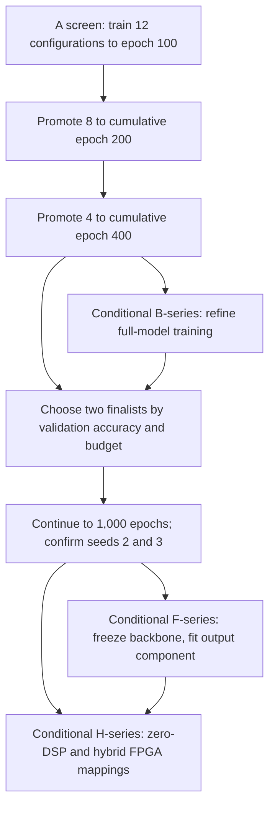
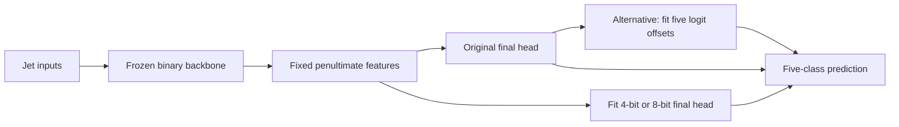
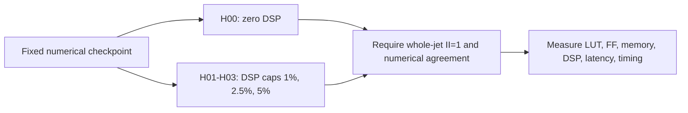

# Current work: accuracy under a computational budget

**Batch `batch20260917` · 17 September 2026**

We are testing which binary-weight transformer architectures improve five-class jet-tagging accuracy while respecting a computational budget and a whole-jet FPGA initiation interval of **II=1**. The immediate work is a controlled 12-configuration training screen. Frozen-backbone classifier fitting and hybrid DSP mappings are separate, conditional follow-ups.

[Detailed protocol](TRAINING_BATCH_PLAN_WITH_FROZEN_BACKBONE_FOLLOWUP.md) · [Run configurations](../../code/hgq2/configs/batch20260917/) · [Machine-readable live status](live-status.json) · [Project results](../../README.md)

<!-- WANDB_LINK_START -->
[Training curves on Weights & Biases](https://wandb.ai/kayamaguchi-uc-san-diego/BNJetTag-Batch20260917) — project `BNJetTag-Batch20260917`, group `batch20260917`. Run links and measurements will appear after registration; an empty project is not evidence that training has started.
<!-- WANDB_LINK_END -->

## How to follow this work

Start with the status table below, open a run’s W&B link for live curves, and use the architecture table to see exactly what changed. W&B updates during training; the GitHub table is a timestamped snapshot refreshed separately. Promotion decisions and validated results will be recorded separately from preliminary training metrics.

## Live snapshot

The table below is a dated status snapshot. Check its timestamp and the [status JSON](live-status.json) before treating it as current. `planned` means that no submission or remote run is recorded; `queued` requires either an explicit submission record or a remote queue state. A blank metric is unmeasured, not zero. Budget feasibility applies to the selected checkpoint, not merely the requested target.

<!-- LIVE_STATUS_START -->

Snapshot refreshed: **2026-09-17T15:01:57Z**. Source: `initial_planning_snapshot`.

| Run | State | Epochs | Latest val accuracy / AUC | Best feasible val accuracy / AUC | Feasible EBOPs / target | Runtime | Source updated UTC |
|---|---|---:|---:|---:|---:|---:|---|
| A00 | planned | — | — / — | — | — / 350,000 | — | — |
| A01 | planned | — | — / — | — | — / 350,000 | — | — |
| A02 | planned | — | — / — | — | — / 350,000 | — | — |
| A03 | planned | — | — / — | — | — / 350,000 | — | — |
| A04 | planned | — | — / — | — | — / 350,000 | — | — |
| A05 | planned | — | — / — | — | — / 350,000 | — | — |
| A06 | planned | — | — / — | — | — / 350,000 | — | — |
| A07 | planned | — | — / — | — | — / 350,000 | — | — |
| A08 | planned | — | — / — | — | — / 350,000 | — | — |
| A09 | planned | — | — / — | — | — / 500,000 | — | — |
| A10 | planned | — | — / — | — | — / 250,000 | — | — |
| A11 | planned | — | — / — | — | — / 500,000 | — | — |

A paused screening rung is not a completed 1,000-epoch run. Blank metrics are unverified or unavailable. Runtime scope and budget-check details are recorded in [live-status.json](live-status.json).

<!-- LIVE_STATUS_END -->

## What we are trying to learn

The earlier investigation verified the accuracy/AUC calculations and found substantial confusion between particular jet classes. **AUC measures ranking; accuracy measures whether the correct class wins.** AUC of 0.85 does not mean 85% of jets are classified correctly. This batch therefore selects checkpoints by **validation categorical accuracy subject to the final native EBOP target**, using AUC as a secondary measurement.

The first screen addresses four questions:

- Does using 16 or 32 constituents retain useful extra information when the EBOP budget is held fixed?
- Does a smaller feed-forward network leave enough budget for useful activation precision, particularly with channel-wise quantization?
- Can a narrower or shallower transformer improve the accuracy/resource tradeoff?
- Are apparent architecture gains actually consequences of relaxing the computational budget?

Native effective bit operations, or EBOPs, are a computational proxy. They do not establish FPGA resource utilization, throughput, or latency. Those require separate hardware measurements.

## Architecture screen: A00–A11

All rows train the **whole model** with binary projection weights and learned activation widths. The initial screen uses initialization seed 1, three input features (`pt`, `etarel`, `phirel`), and five classes (`g`, `q`, `W`, `Z`, `t`). N is constituent count, D embedding width, F feed-forward hidden width, L transformer blocks, and H attention heads.

| Config | N | D | F | L | H | Activation granularity | EBOP target | Main comparison |
|---|---:|---:|---:|---:|---:|---|---:|---|
| [A00](../../code/hgq2/configs/batch20260917/batch20260917-a00-s1.json) | 8 | 32 | 64 | 2 | 4 | Channel | 350k | Accuracy-selected reference |
| [A01](../../code/hgq2/configs/batch20260917/batch20260917-a01-s1.json) | 8 | 32 | 64 | 2 | 4 | Tensor | 350k | Granularity alone |
| [A02](../../code/hgq2/configs/batch20260917/batch20260917-a02-s1.json) | 8 | 32 | 32 | 2 | 4 | Channel | 350k | Smaller FFN with channel widths |
| [A03](../../code/hgq2/configs/batch20260917/batch20260917-a03-s1.json) | 8 | 32 | 32 | 2 | 4 | Tensor | 350k | Complete FFN/granularity comparison |
| [A04](../../code/hgq2/configs/batch20260917/batch20260917-a04-s1.json) | 16 | 32 | 32 | 2 | 4 | Channel | 350k | More constituents at matched budget |
| [A05](../../code/hgq2/configs/batch20260917/batch20260917-a05-s1.json) | 32 | 32 | 32 | 2 | 4 | Channel | 350k | More information versus attention cost |
| [A06](../../code/hgq2/configs/batch20260917/batch20260917-a06-s1.json) | 16 | 16 | 32 | 2 | 4 | Channel | 350k | Narrower embedding |
| [A07](../../code/hgq2/configs/batch20260917/batch20260917-a07-s1.json) | 16 | 32 | 32 | 1 | 4 | Channel | 350k | One transformer block |
| [A08](../../code/hgq2/configs/batch20260917/batch20260917-a08-s1.json) | 16 | 32 | 32 | 2 | 2 | Channel | 350k | Fewer heads at fixed D |
| [A09](../../code/hgq2/configs/batch20260917/batch20260917-a09-s1.json) | 16 | 32 | 32 | 2 | 4 | Channel | 500k | Relaxed resource pressure |
| [A10](../../code/hgq2/configs/batch20260917/batch20260917-a10-s1.json) | 16 | 32 | 32 | 2 | 4 | Channel | 250k | Tighter resource pressure |
| [A11](../../code/hgq2/configs/batch20260917/batch20260917-a11-s1.json) | 8 | 32 | 32 | 2 | 4 | Channel | 500k | Complete N/budget comparison |

Every configuration keeps a 1,000-epoch schedule. Screening pauses and resumes the same run at cumulative epochs 100, 200, and 400; it does not restart or shorten the learning-rate schedule. A00 remains a control through epoch 400. The 250k and 500k probes stay separate from the primary 350k comparison.

## Training stages and follow-ups

| Stage | What changes | What remains fixed | Release condition |
|---|---|---|---|
| A | Architecture, activation granularity, or target budget | Common training/data protocol | Preflight and resume checks pass |
| B | Selected precision or optimization setting | Recorded winning 350k architecture | A-screen evidence identifies a useful test |
| F | Final classifier or output offsets | Trained backbone and its quantizers | Finalist checkpoint and cached features verified |
| H | Arithmetic placement and selected reuse settings | Numerical checkpoint, precision, and I/O contract | Export and numerical checks pass |

The default B queue contains four candidate refinements: an activation-width cap, a protective width floor plus cap, 8-bit attention probabilities, and a learning-rate comparison. Width constraints need implementation and native-bitwidth tests before use. Other B rows remain conditional; see the [full protocol](TRAINING_BATCH_PLAN_WITH_FROZEN_BACKBONE_FOLLOWUP.md#b-series-conditional-training-refinements).

The F-series compares the original frozen model, output-bias fitting, and 4-bit/8-bit final classifiers. Head refitting and output-bias fitting are **alternative models**. Refitting an 8-bit final layer yields a mixed-precision model with a binary backbone; it does not produce an entirely binary network.

## Hardware: II=1 with optional DSP use

The H-series starts at reuse factor 1 and compares **0%, 1%, 2.5%, and 5% device-wide DSP caps** on identical checkpoints. These are exploratory caps, not confirmed integration allocations. Binary sign/addition operations remain fabric-based initially; eligible nonbinary products can be mapped to DSPs. Reuse factors 2 and 4 are conditional follow-ups on selected nonbinary operations.

II=1 means accepting a new **whole jet** every clock cycle, not merely one token per cycle. The requested clock is 2.5 ns, with latency below 1 microsecond as a provisional screening ceiling pending integration requirements. Neither setting is a measured result. Selected designs require multi-transaction co-simulation and implementation timing checks; synthesis estimates alone are insufficient.

## Resource discipline and reporting

The A-screen allocation is **2,800 epoch passes**: 12×100, then 8×100 additional, then 4×200 additional. At most two GPU training jobs run concurrently. Epoch passes are not GPU-hours; measured seconds per epoch and peak memory determine the remaining-cost forecast. Frozen-feature preparation, head fitting, metric checks, and hardware synthesis use suitable CPU resources.

Conditional default B refinements, finalist continuation, and seeds 2/3 bring the full proposed allocation to **8,800 epoch passes** if every stage proceeds, excluding optional tests, head fits, teacher training, and hardware builds. Promotion decisions retain budget feasibility, matched-prefix controls, and the reason each run continues or stops.

Each run record should contain its config/code/data hashes, selected checkpoint and epoch, validation accuracy/AUC, native cost and width distributions, duration, and promotion outcome. Finalists add confusion matrices, class-wise metrics, seed variation, and measured hardware results. Failed or over-budget runs remain visible in the record.

## Status freshness

The W&B links provide live training curves. This GitHub page is a dated snapshot; a finished screening interval is not a completed 1,000-epoch experiment.
