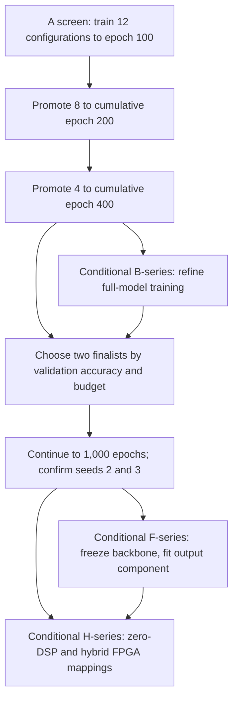
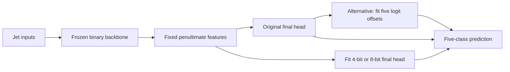
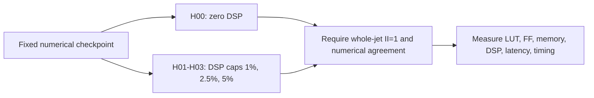

# Current work: accuracy under a computational budget

**Updated 23 September 2026 · batches `batch20260917` and `batch20260918`**

We tested which binary-weight transformer architectures improve five-class jet-tagging accuracy while respecting a computational budget and a whole-jet FPGA initiation interval of **II=1**. All 27 architecture and attention runs reached 1,000 epochs. Five architecture runs have a feasible checkpoint; none of the 15 attention runs does. The original seven ablations also completed 1,000 epochs. Frozen-output classifier fitting and hybrid DSP mappings are separate follow-ups.

[Final A/B results](TRAINING_RESULTS_20260923.md) · [N8/N64 exploratory screen](CONSTITUENT_SCREEN_20260923.md) · [Original protocol](TRAINING_BATCH_PLAN_WITH_FROZEN_BACKBONE_FOLLOWUP.md) · [Machine-readable final snapshot](training-results-20260923.json) · [Project results](../../README.md)

<!-- WANDB_LINK_START -->
[Training curves on Weights & Biases](https://wandb.ai/kayamaguchi-uc-san-diego/BNJetTag-Batch20260917) — both campaigns use project `BNJetTag-Batch20260917`, with groups `batch20260917` and `batch20260918`. Live curves may require project access. The September 23 numerical snapshot comes from durable trainer records. Project visibility was not changed.
<!-- WANDB_LINK_END -->

## Engram lookup-memory study

The separate [Engram study and source](ENGRAM_STUDY.md) records all four original E00–E03 training loops at 1,000 epochs. E00 passed its outer validation; E01–E03 failed final metric reproduction. None has a feasible checkpoint. The [matched N8/N64 exploratory screen](CONSTITUENT_SCREEN_20260923.md) separately tested 38 architecture, attention and memory cases under a 50-epoch schedule and also found no feasible checkpoint.

## How to follow this work

Start with the final status below, then use the linked result report for every endpoint and limitation. The selected architecture values are trainer-recorded internal-validation metrics; held-out evaluation and seed replication remain separate steps.

## Current execution status

**Snapshot: 23 September 2026, 15:53 PDT (22:53 UTC).** All 27 public continuation runs finished their 1,000-epoch schedules. Five architecture runs recorded a checkpoint within their own final budgets. None of the 15 attention runs recorded a checkpoint within its 350,000-EBOP budget.

| Campaign | Runs | Finished runs | Active runs | Runs with a feasible checkpoint |
|---|---:|---:|---:|---:|
| Architecture, A00–A11 | 12 | 12 | 0 | 5 |
| Attention, B00–B04 × seeds 4–6 | 15 | 15 | 0 | 0 |

**[Final results and limitations](TRAINING_RESULTS_20260923.md)** · [Exact recorded metrics](training-results-20260923.json) · [Continuation launch record](FULL_LENGTH_CONTINUATION_20260920.md).

The separate [R4 hardware study](R4_HARDWARE_SYNTHESIS.md) retains its dated hardware record. This update adds no FPGA resource, latency, or II measurements.

## Architecture checkpoints within budget

<!-- LIVE_STATUS_START -->

Internal-validation results, 124,000 jets, initialization seed 1; not independently recomputed from predictions in this update. Selected epochs are one-based.

| Run | Completed epochs | Selected epoch | Validation accuracy | Macro-OvR AUC | Native EBOPs | Budget |
|---|---:|---:|---:|---:|---:|---:|
| A00 / seed 1 | 1,000 | 1,000 | 59.80% | 0.8585 | 323,771 | 350,000 |
| A01 / seed 1 | 1,000 | 618 | 58.25% | 0.8473 | 344,270 | 350,000 |
| A02 / seed 1 | 1,000 | 913 | 61.08% | 0.8612 | 349,298 | 350,000 |
| A03 / seed 1 | 1,000 | 1,000 | 59.44% | 0.8563 | 346,222 | 350,000 |
| A11 / seed 1 | 1,000 | 789 | 62.62% | 0.8749 | 479,462 | 500,000 |

A02 is the leading 350k candidate for held-out evaluation. A11 has a larger 500k budget. The other seven architecture runs have no feasible checkpoint at their configured targets. No seed-robust or held-out superiority claim follows from this table.

Earlier snapshots: [100-epoch architecture measurements](live-status.json), [400-epoch attention measurements](batch20260918-status.json), [September 20 screening report](TRAINING_PROGRESS_20260920.md), [September 21 progress report](TRAINING_PROGRESS_20260921.md).

<!-- LIVE_STATUS_END -->

## The 15 additional runs: all finished, none within budget

Five configurations are each trained from scratch with **matched initialization seeds 4, 5, and 6**. All use the A04 reference: 16 constituents, D=32, FFN=32, two transformer blocks, four heads, channel-wise learned activation widths, binary projection weights, and a final 350k-EBOP target. A04 is a controlled reference, not the winner of the 100-epoch screen.

| Arm | Change from A04 | Question | Runs |
|---|---|---|---:|
| B00 | None | Establish matched controls and seed variation | 3 |
| B01 | Attention heads 4 → 1 | Does a single head improve the accuracy/resource tradeoff? | 3 |
| B02 | Remove the learned positional table | How much does explicit constituent-rank encoding contribute? | 3 |
| B03 | Softmax output precision 10 → 8 bits | Can cheaper attention probabilities free useful activation budget? | 3 |
| B04 | EBOP target 525k → 420k at epoch 100 → 350k at epoch 200 | Does delaying compression preserve useful representations? | 3 |
| **Total** | **Five configurations × three seeds** | | **15** |

All 15 runs completed their **1,000-epoch schedules**. None has a feasible checkpoint. At the final epoch, B01 has the lowest mean cost at 465,004 EBOPs and B03 has the strongest mean accuracy at 39.02%; exact per-seed endpoints and spreads are in the [final report](TRAINING_RESULTS_20260923.md#attention-results). Selection always uses the final target, including during B04’s relaxed-budget phase. These are full-model training runs.

The positional-encoding switch has been implemented in the submitted training bundle and synthetic preflight passed. **B02 export still needs changes before HLS** because existing exporters assume a positional layer. See [exact configs and training protocol](BATCH20260918_ATTENTION_STUDY.md).

## What we are trying to learn

The earlier investigation verified the accuracy/AUC calculations and found substantial confusion between particular jet classes. **AUC measures ranking; accuracy measures whether the correct class wins.** AUC of 0.85 does not mean 85% of jets are classified correctly. This batch therefore selects checkpoints by **validation categorical accuracy subject to the final native EBOP target**, using AUC as a secondary measurement.

The first screen addresses four questions:

- Does using 16 or 32 constituents retain useful extra information when the EBOP budget is held fixed?
- Does a smaller feed-forward network leave enough budget for useful activation precision, particularly with channel-wise quantization?
- Can a narrower or shallower transformer improve the accuracy/resource tradeoff?
- Are apparent architecture gains actually consequences of relaxing the computational budget?

Native effective bit operations, or EBOPs, are a computational proxy. They do not establish FPGA resource utilization, throughput, or latency. Those require separate hardware measurements.

## Architecture screen: A00–A11

All rows train the **whole model** with binary projection weights and learned activation widths. The initial screen uses initialization seed 1, three input features (`pt`, `etarel`, `phirel`), and five classes (`g`, `q`, `W`, `Z`, `t`). N is constituent count, D embedding width, F feed-forward hidden width, L transformer blocks, and H attention heads.

| Config | N | D | F | L | H | Activation granularity | EBOP target | Main comparison |
|---|---:|---:|---:|---:|---:|---|---:|---|
| [A00](../../code/hgq2/configs/batch20260917/batch20260917-a00-s1.json) | 8 | 32 | 64 | 2 | 4 | Channel | 350k | Accuracy-selected reference |
| [A01](../../code/hgq2/configs/batch20260917/batch20260917-a01-s1.json) | 8 | 32 | 64 | 2 | 4 | Tensor | 350k | Granularity alone |
| [A02](../../code/hgq2/configs/batch20260917/batch20260917-a02-s1.json) | 8 | 32 | 32 | 2 | 4 | Channel | 350k | Smaller FFN with channel widths |
| [A03](../../code/hgq2/configs/batch20260917/batch20260917-a03-s1.json) | 8 | 32 | 32 | 2 | 4 | Tensor | 350k | Complete FFN/granularity comparison |
| [A04](../../code/hgq2/configs/batch20260917/batch20260917-a04-s1.json) | 16 | 32 | 32 | 2 | 4 | Channel | 350k | More constituents at matched budget |
| [A05](../../code/hgq2/configs/batch20260917/batch20260917-a05-s1.json) | 32 | 32 | 32 | 2 | 4 | Channel | 350k | More information versus attention cost |
| [A06](../../code/hgq2/configs/batch20260917/batch20260917-a06-s1.json) | 16 | 16 | 32 | 2 | 4 | Channel | 350k | Narrower embedding |
| [A07](../../code/hgq2/configs/batch20260917/batch20260917-a07-s1.json) | 16 | 32 | 32 | 1 | 4 | Channel | 350k | One transformer block |
| [A08](../../code/hgq2/configs/batch20260917/batch20260917-a08-s1.json) | 16 | 32 | 32 | 2 | 2 | Channel | 350k | Fewer heads at fixed D |
| [A09](../../code/hgq2/configs/batch20260917/batch20260917-a09-s1.json) | 16 | 32 | 32 | 2 | 4 | Channel | 500k | Relaxed resource pressure |
| [A10](../../code/hgq2/configs/batch20260917/batch20260917-a10-s1.json) | 16 | 32 | 32 | 2 | 4 | Channel | 250k | Tighter resource pressure |
| [A11](../../code/hgq2/configs/batch20260917/batch20260917-a11-s1.json) | 8 | 32 | 32 | 2 | 4 | Channel | 500k | Complete N/budget comparison |

Every configuration keeps a 1,000-epoch schedule. Screening pauses and resumes the same run at cumulative epochs 100, 200, and 400; it does not restart or shorten the learning-rate schedule. A00 remains a control through epoch 400. The 250k and 500k probes stay separate from the primary 350k comparison.

## Training stages and follow-ups

**Historical plan:** the selective promotion diagram below describes the original protocol. The September 20 amendment continued every current architecture/attention arm to 1,000 epochs. Conditional classifier fitting, seed confirmation and hardware studies have not been implied by that continuation.

| Stage | What changes | What remains fixed | Release condition |
|---|---|---|---|
| A | Architecture, activation granularity, or target budget | Common training/data protocol | Preflight and resume checks pass |
| B | Selected precision or optimization setting | Recorded winning 350k architecture | A-screen evidence identifies a useful test |
| F | Final classifier or output offsets | Trained backbone and its quantizers | Finalist checkpoint and cached features verified |
| H | Arithmetic placement and selected reuse settings | Numerical checkpoint, precision, and I/O contract | Export and numerical checks pass |

The original protocol’s conditional B queue contains four candidate refinements: an activation-width cap, a protective width floor plus cap, 8-bit attention probabilities, and a learning-rate comparison. Width constraints need implementation and native-bitwidth tests before use. This earlier menu is separate from the submitted `batch20260918` campaign above; its unlaunched rows remain conditional. See the [full protocol](TRAINING_BATCH_PLAN_WITH_FROZEN_BACKBONE_FOLLOWUP.md#b-series-conditional-training-refinements).

The F-series compares the original frozen model, output-bias fitting, and 4-bit/8-bit final classifiers. Head refitting and output-bias fitting are **alternative models**. Refitting an 8-bit final layer yields a mixed-precision model with a binary backbone; it does not produce an entirely binary network.

## Hardware: II=1 with optional DSP use

The H-series starts at reuse factor 1 and compares **0%, 1%, 2.5%, and 5% device-wide DSP caps** on identical checkpoints. These are exploratory caps, not confirmed integration allocations. Binary sign/addition operations remain fabric-based initially; eligible nonbinary products can be mapped to DSPs. Reuse factors 2 and 4 are conditional follow-ups on selected nonbinary operations.

II=1 means accepting a new **whole jet** every clock cycle, not merely one token per cycle. The requested clock is 2.5 ns, with latency below 1 microsecond as a provisional screening ceiling pending integration requirements. Neither setting is a measured result. Selected designs require multi-transaction co-simulation and implementation timing checks; synthesis estimates alone are insufficient.

## Resource discipline and reporting

The allocation figures below describe the original selective plan. The current amendment instead authorizes 12×1,000 architecture and 15×1,000 attention epoch passes across their full histories; these counts do not measure GPU-hours. Actual completion and feasibility are reported in the September 21 snapshot above.

The A-screen allocation is **2,800 epoch passes**: 12×100, then 8×100 additional, then 4×200 additional. The recovered first rung used configured parallelism 12; the submitted follow-up uses parallelism 15. Actual concurrency depends on scheduling and worker readiness. Epoch passes are not GPU-hours; measured seconds per epoch and peak memory determine the remaining-cost forecast. Frozen-feature preparation, head fitting, metric checks, and hardware synthesis use suitable CPU resources.

Conditional default B refinements, finalist continuation, and seeds 2/3 bring the full proposed allocation to **8,800 epoch passes** if every stage proceeds, excluding optional tests, head fits, teacher training, and hardware builds. Promotion decisions retain budget feasibility, matched-prefix controls, and the reason each run continues or stops.

The new 15-run campaign adds **6,000 screening epoch passes** (15×400). Continuing the reference and two variant arms across three seeds would add **5,400** more (9×600), for **11,400** if that continuation proceeds. This allocation is separate from the original 8,800-pass plan; overlapping future refinement stages must be reconciled before execution. No GPU-hour estimate is inferred from epoch counts.

Each run record should contain its config/code/data hashes, selected checkpoint and epoch, validation accuracy/AUC, native cost and width distributions, duration, and promotion outcome. Finalists add confusion matrices, class-wise metrics, seed variation, and measured hardware results. Failed or over-budget runs remain visible in the record.

## Status freshness

The W&B links provide training curves. This GitHub page records the completed 1,000-epoch campaigns as a dated snapshot.
