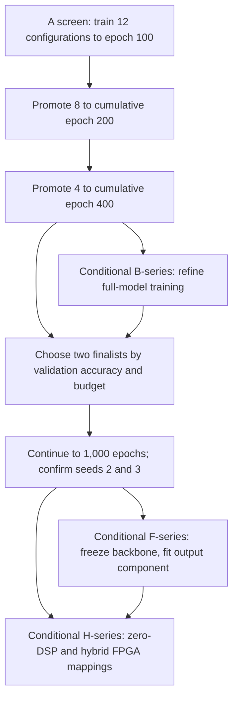
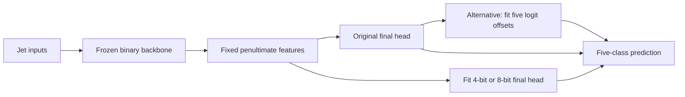
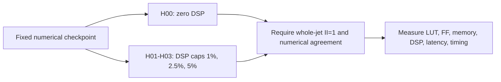

# Current work: accuracy under a computational budget

**Updated 20 September 2026 · batches `batch20260917` and `batch20260918`**

We are testing which binary-weight transformer architectures improve five-class jet-tagging accuracy while respecting a computational budget and a whole-jet FPGA initiation interval of **II=1**. The original 12-configuration screen has reached its first 100-epoch checkpoint. The further 15 runs testing attention design, attention precision, and compression timing have completed their 400-epoch screen. All seven original ablations have now completed 1,000 epochs. Frozen-backbone classifier fitting and hybrid DSP mappings are separate, conditional follow-ups.

[15-run follow-up](BATCH20260918_ATTENTION_STUDY.md) · [Original protocol](TRAINING_BATCH_PLAN_WITH_FROZEN_BACKBONE_FOLLOWUP.md) · [Run configurations](../../code/hgq2/configs/batch20260917/) · [Machine-readable live status](live-status.json) · [Project results](../../README.md)

<!-- WANDB_LINK_START -->
[Training curves on Weights & Biases](https://wandb.ai/kayamaguchi-uc-san-diego/BNJetTag-Batch20260917) — both campaigns use project `BNJetTag-Batch20260917`, with groups `batch20260917` and `batch20260918`. Live curves may require project access. This public page includes the requested numerical summaries, fetched through the authenticated W&B API; project visibility was not changed.
<!-- WANDB_LINK_END -->

## How to follow this work

Start with the status table below, open a run’s W&B link for live curves, and use the architecture table to see exactly what changed. W&B updates during training; the GitHub table is a timestamped snapshot refreshed separately. Promotion decisions and validated results will be recorded separately from preliminary training metrics.

## Current execution status

**All 27 public architecture and attention runs are submitted for full 1,000-epoch continuation.** Snapshot **2026-09-20T22:08:06.102882+00:00**: 11 Running, 16 Pending. Pending runs are queued for shared resources; Running containers may still be starting. The original seven ablations have already completed 1,000 epochs.

**[Continuation status and checkpoint guarantees](FULL_LENGTH_CONTINUATION_20260920.md)** · **[Complete screening metrics](TRAINING_PROGRESS_20260920.md)**. The six previously unavailable attention summaries were recovered from W&B. All 15 last screening checkpoints exceed 350k EBOPs, and all 27 durable screening states record no feasible checkpoint at their own targets. Per-run source timestamps distinguish historical screening metrics from resumed execution.

The separate [R4 hardware study](R4_HARDWARE_SYNTHESIS.md) retains its dated hardware record. This training update adds no FPGA resource, latency, or II measurements.

## W&B results: first 100-epoch screen

<!-- LIVE_STATUS_START -->

Snapshot fetched: **2026-09-18T12:16:51Z**, through the authenticated W&B API. All values below are **latest-epoch internal-validation measurements**, on the common 124,000-event validation split, with initialization seed 1. They are not held-out test results or selected budget-feasible checkpoints.

| Run | Epochs | Latest validation accuracy | Latest macro-OvR AUC | Latest native EBOPs | Final target | Within target? |
|---|---:|---:|---:|---:|---:|---|
| [A00](https://wandb.ai/kayamaguchi-uc-san-diego/BNJetTag-Batch20260917/runs/8b75fad4710f) | 100 | 58.3468% | 0.848755 | 599,799 | 350,000 | No |
| [A01](https://wandb.ai/kayamaguchi-uc-san-diego/BNJetTag-Batch20260917/runs/8cdfda97a5a5) | 100 | 53.8419% | 0.822689 | 456,462 | 350,000 | No |
| [A02](https://wandb.ai/kayamaguchi-uc-san-diego/BNJetTag-Batch20260917/runs/2d39a44e8179) | 100 | 58.1605% | 0.850718 | 570,630 | 350,000 | No |
| [A03](https://wandb.ai/kayamaguchi-uc-san-diego/BNJetTag-Batch20260917/runs/968ae5d77f36) | 100 | 57.3113% | 0.844536 | 443,662 | 350,000 | No |
| [A04](https://wandb.ai/kayamaguchi-uc-san-diego/BNJetTag-Batch20260917/runs/d8fca5f337d4) | 100 | 49.2258% | 0.801304 | 834,733 | 350,000 | No |
| [A05](https://wandb.ai/kayamaguchi-uc-san-diego/BNJetTag-Batch20260917/runs/0f7f39c0d625) | 100 | 37.7177% | 0.681871 | 2,496,133 | 350,000 | No |
| [A06](https://wandb.ai/kayamaguchi-uc-san-diego/BNJetTag-Batch20260917/runs/c8390667f58e) | 100 | 57.4411% | 0.846978 | 692,894 | 350,000 | No |
| [A07](https://wandb.ai/kayamaguchi-uc-san-diego/BNJetTag-Batch20260917/runs/2182aedd5fba) | 100 | 55.8363% | 0.838775 | 553,981 | 350,000 | No |
| [A08](https://wandb.ai/kayamaguchi-uc-san-diego/BNJetTag-Batch20260917/runs/422cac75fde4) | 100 | 48.8831% | 0.808782 | 692,305 | 350,000 | No |
| [A09](https://wandb.ai/kayamaguchi-uc-san-diego/BNJetTag-Batch20260917/runs/92c3adf8ea07) | 100 | 53.6984% | 0.823393 | 937,044 | 500,000 | No |
| [A10](https://wandb.ai/kayamaguchi-uc-san-diego/BNJetTag-Batch20260917/runs/8de4f4468d17) | 100 | 47.5806% | 0.789301 | 788,177 | 250,000 | No |
| [A11](https://wandb.ai/kayamaguchi-uc-san-diego/BNJetTag-Batch20260917/runs/722576c02e4e) | 100 | 61.2129% | 0.865581 | 688,677 | 500,000 | No |

**Every latest checkpoint remains above its own EBOP target.** A11 has the highest latest validation accuracy (61.2129%), at 688,677 EBOPs against a 500,000 target. Among the 350,000-target rows, A00 has the highest latest validation accuracy (58.3468%), at 599,799 EBOPs. These are descriptive screening observations, not established improvements or deployment-ready winners. The September20 continuation preflight subsequently inspected all12 durable checkpoint states and found `best_feasible=null` for every run. See [checkpoint-state evidence](checkpoint-screen-status-20260920.json).

The screen has not established convergence or training-seed robustness. Promotion must consider learning curves, cost trajectories, matched controls, and the configured final budget. Checkpoint selection continues to use validation accuracy subject to that budget. W&B AUC and accuracy are reported directly here and have not been independently recomputed from prediction arrays for this update.

Exact values, source timestamps, runtime scope, and config hashes are in [live-status.json](live-status.json). The [allowlisted W&B source snapshot](wandb-snapshot-20260918.json) preserves the queried summary fields for both campaigns. Runtime from a resumed W&B session is not necessarily total GPU time.

<!-- LIVE_STATUS_END -->

## The 15 additional runs: 400-epoch screen complete

Five configurations are each trained from scratch with **matched initialization seeds 4, 5, and 6**. All use the A04 reference: 16 constituents, D=32, FFN=32, two transformer blocks, four heads, channel-wise learned activation widths, binary projection weights, and a final 350k-EBOP target. A04 is a controlled reference, not the winner of the 100-epoch screen.

| Arm | Change from A04 | Question | Runs |
|---|---|---|---:|
| B00 | None | Establish matched controls and seed variation | 3 |
| B01 | Attention heads 4 → 1 | Does a single head improve the accuracy/resource tradeoff? | 3 |
| B02 | Remove the learned positional table | How much does explicit constituent-rank encoding contribute? | 3 |
| B03 | Softmax output precision 10 → 8 bits | Can cheaper attention probabilities free useful activation budget? | 3 |
| B04 | EBOP target 525k → 420k at epoch 100 → 350k at epoch 200 | Does delaying compression preserve useful representations? | 3 |
| **Total** | **Five configurations × three seeds** | | **15** |

Each run pauses at cumulative **400 epochs** of an unchanged **1,000-epoch schedule**. The planned continuation is B00 plus the two strongest variant arms, retaining all three seeds. B04 spends the final 200 screening epochs at the 350k target; selection always uses the final target, including during its relaxed-budget phase. These are full-model training runs. The B00–B04 identifiers belong specifically to `batch20260918`; they do not refer to the older conditional B-series menu.

The positional-encoding switch has been implemented in the submitted training bundle and synthetic preflight passed. **B02 export still needs changes before HLS** because existing exporters assume a positional layer. See [exact configs and training protocol](BATCH20260918_ATTENTION_STUDY.md).

## What we are trying to learn

The earlier investigation verified the accuracy/AUC calculations and found substantial confusion between particular jet classes. **AUC measures ranking; accuracy measures whether the correct class wins.** AUC of 0.85 does not mean 85% of jets are classified correctly. This batch therefore selects checkpoints by **validation categorical accuracy subject to the final native EBOP target**, using AUC as a secondary measurement.

The first screen addresses four questions:

- Does using 16 or 32 constituents retain useful extra information when the EBOP budget is held fixed?
- Does a smaller feed-forward network leave enough budget for useful activation precision, particularly with channel-wise quantization?
- Can a narrower or shallower transformer improve the accuracy/resource tradeoff?
- Are apparent architecture gains actually consequences of relaxing the computational budget?

Native effective bit operations, or EBOPs, are a computational proxy. They do not establish FPGA resource utilization, throughput, or latency. Those require separate hardware measurements.

## Architecture screen: A00–A11

All rows train the **whole model** with binary projection weights and learned activation widths. The initial screen uses initialization seed 1, three input features (`pt`, `etarel`, `phirel`), and five classes (`g`, `q`, `W`, `Z`, `t`). N is constituent count, D embedding width, F feed-forward hidden width, L transformer blocks, and H attention heads.

| Config | N | D | F | L | H | Activation granularity | EBOP target | Main comparison |
|---|---:|---:|---:|---:|---:|---|---:|---|
| [A00](../../code/hgq2/configs/batch20260917/batch20260917-a00-s1.json) | 8 | 32 | 64 | 2 | 4 | Channel | 350k | Accuracy-selected reference |
| [A01](../../code/hgq2/configs/batch20260917/batch20260917-a01-s1.json) | 8 | 32 | 64 | 2 | 4 | Tensor | 350k | Granularity alone |
| [A02](../../code/hgq2/configs/batch20260917/batch20260917-a02-s1.json) | 8 | 32 | 32 | 2 | 4 | Channel | 350k | Smaller FFN with channel widths |
| [A03](../../code/hgq2/configs/batch20260917/batch20260917-a03-s1.json) | 8 | 32 | 32 | 2 | 4 | Tensor | 350k | Complete FFN/granularity comparison |
| [A04](../../code/hgq2/configs/batch20260917/batch20260917-a04-s1.json) | 16 | 32 | 32 | 2 | 4 | Channel | 350k | More constituents at matched budget |
| [A05](../../code/hgq2/configs/batch20260917/batch20260917-a05-s1.json) | 32 | 32 | 32 | 2 | 4 | Channel | 350k | More information versus attention cost |
| [A06](../../code/hgq2/configs/batch20260917/batch20260917-a06-s1.json) | 16 | 16 | 32 | 2 | 4 | Channel | 350k | Narrower embedding |
| [A07](../../code/hgq2/configs/batch20260917/batch20260917-a07-s1.json) | 16 | 32 | 32 | 1 | 4 | Channel | 350k | One transformer block |
| [A08](../../code/hgq2/configs/batch20260917/batch20260917-a08-s1.json) | 16 | 32 | 32 | 2 | 2 | Channel | 350k | Fewer heads at fixed D |
| [A09](../../code/hgq2/configs/batch20260917/batch20260917-a09-s1.json) | 16 | 32 | 32 | 2 | 4 | Channel | 500k | Relaxed resource pressure |
| [A10](../../code/hgq2/configs/batch20260917/batch20260917-a10-s1.json) | 16 | 32 | 32 | 2 | 4 | Channel | 250k | Tighter resource pressure |
| [A11](../../code/hgq2/configs/batch20260917/batch20260917-a11-s1.json) | 8 | 32 | 32 | 2 | 4 | Channel | 500k | Complete N/budget comparison |

Every configuration keeps a 1,000-epoch schedule. Screening pauses and resumes the same run at cumulative epochs 100, 200, and 400; it does not restart or shorten the learning-rate schedule. A00 remains a control through epoch 400. The 250k and 500k probes stay separate from the primary 350k comparison.

## Training stages and follow-ups

| Stage | What changes | What remains fixed | Release condition |
|---|---|---|---|
| A | Architecture, activation granularity, or target budget | Common training/data protocol | Preflight and resume checks pass |
| B | Selected precision or optimization setting | Recorded winning 350k architecture | A-screen evidence identifies a useful test |
| F | Final classifier or output offsets | Trained backbone and its quantizers | Finalist checkpoint and cached features verified |
| H | Arithmetic placement and selected reuse settings | Numerical checkpoint, precision, and I/O contract | Export and numerical checks pass |

The original protocol’s conditional B queue contains four candidate refinements: an activation-width cap, a protective width floor plus cap, 8-bit attention probabilities, and a learning-rate comparison. Width constraints need implementation and native-bitwidth tests before use. This earlier menu is separate from the submitted `batch20260918` campaign above; its unlaunched rows remain conditional. See the [full protocol](TRAINING_BATCH_PLAN_WITH_FROZEN_BACKBONE_FOLLOWUP.md#b-series-conditional-training-refinements).

The F-series compares the original frozen model, output-bias fitting, and 4-bit/8-bit final classifiers. Head refitting and output-bias fitting are **alternative models**. Refitting an 8-bit final layer yields a mixed-precision model with a binary backbone; it does not produce an entirely binary network.

## Hardware: II=1 with optional DSP use

The H-series starts at reuse factor 1 and compares **0%, 1%, 2.5%, and 5% device-wide DSP caps** on identical checkpoints. These are exploratory caps, not confirmed integration allocations. Binary sign/addition operations remain fabric-based initially; eligible nonbinary products can be mapped to DSPs. Reuse factors 2 and 4 are conditional follow-ups on selected nonbinary operations.

II=1 means accepting a new **whole jet** every clock cycle, not merely one token per cycle. The requested clock is 2.5 ns, with latency below 1 microsecond as a provisional screening ceiling pending integration requirements. Neither setting is a measured result. Selected designs require multi-transaction co-simulation and implementation timing checks; synthesis estimates alone are insufficient.

## Resource discipline and reporting

The A-screen allocation is **2,800 epoch passes**: 12×100, then 8×100 additional, then 4×200 additional. The recovered first rung used configured parallelism 12; the submitted follow-up uses parallelism 15. Actual concurrency depends on scheduling and worker readiness. Epoch passes are not GPU-hours; measured seconds per epoch and peak memory determine the remaining-cost forecast. Frozen-feature preparation, head fitting, metric checks, and hardware synthesis use suitable CPU resources.

Conditional default B refinements, finalist continuation, and seeds 2/3 bring the full proposed allocation to **8,800 epoch passes** if every stage proceeds, excluding optional tests, head fits, teacher training, and hardware builds. Promotion decisions retain budget feasibility, matched-prefix controls, and the reason each run continues or stops.

The new 15-run campaign adds **6,000 screening epoch passes** (15×400). Continuing the reference and two variant arms across three seeds would add **5,400** more (9×600), for **11,400** if that continuation proceeds. This allocation is separate from the original 8,800-pass plan; overlapping future refinement stages must be reconciled before execution. No GPU-hour estimate is inferred from epoch counts.

Each run record should contain its config/code/data hashes, selected checkpoint and epoch, validation accuracy/AUC, native cost and width distributions, duration, and promotion outcome. Finalists add confusion matrices, class-wise metrics, seed variation, and measured hardware results. Failed or over-budget runs remain visible in the record.

## Status freshness

The W&B links provide live training curves. This GitHub page is a dated snapshot; a finished screening interval is not a completed 1,000-epoch experiment.
