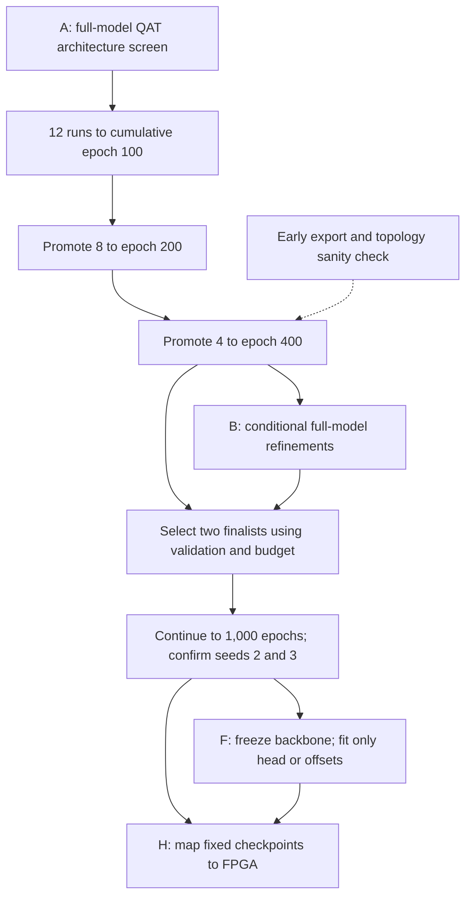
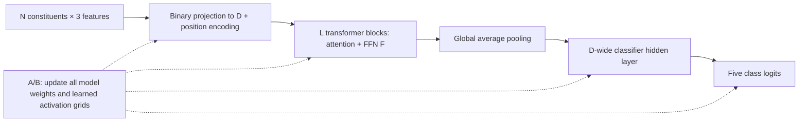
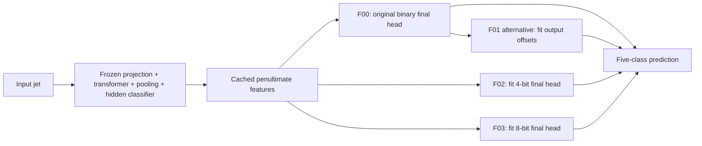
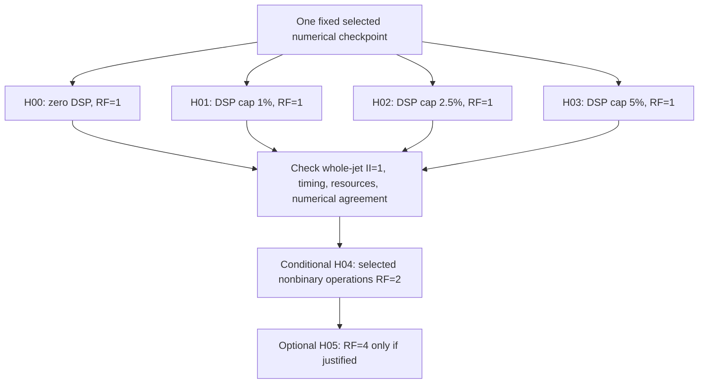

# Training batch plan with explicitly separate frozen-backbone follow-up

Protocol date: 2026-09-17. Scope: **initial A-series screen; B/F/H stages conditional**.

This is the protocol for the current training batch. Run state belongs in the [work hub](README.md) and its [machine-readable snapshot](live-status.json); the design below does not claim that a planned run has started or completed.

The primary batch trains the entire binary-weight transformer. It is **not frozen-backbone training**. The later F-series explicitly freezes the backbone and changes only the final classifier or output biases. Frozen-backbone results are separate from the new A-series.

## Stages and boundaries



Only the A-series is the initial 12-run architecture screen. B changes how the entire model is trained. F preserves a trained feature extractor and fits a small output component. H changes hardware mapping of fixed numerical checkpoints. Conditional work is released after its stated checks and selection rules; the diagram does not indicate that these stages are already running.

## Recommendation and evidence

Start with 12 controlled architecture/resource configurations, screen them progressively to 400 epochs, then refine the strongest 350k-EBOP architecture. Extend two finalists to 1,000 epochs and confirm them with two additional seeds. Evaluate zero-DSP and hybrid FPGA mappings of the same selected checkpoints under **top-level II=1**. A training EBOP target is a resource proxy, not a hardware feasibility certificate.

The priority order is: (1) constituents jointly with EBOP budget and model width; (2) FFN size and activation granularity; (3) activation-width collapse and attention precision; (4) embedding, layers, and heads; (5) pressure schedule and optimizer settings guided by observed curves; (6) recovery and distillation. An early hardware feasibility check tests whether the selected topologies can be implemented. Frozen-backbone head fitting is an inexpensive follow-up to completed checkpoints.

Accuracy and macro one-versus-rest AUC measure different behavior. This batch emphasizes validation accuracy under a resource constraint; historical numerical results remain in the existing project record.

## Common architecture and training method

All A-series runs use the following defaults unless their row overrides them. N=constituents, D=embedding width, F=FFN hidden width, L=transformer blocks, H=attention heads. Architecture: three input features → binary projection to D → learned position encoding → L attention/FFN residual blocks → global average pooling → D-wide hidden classifier → five logits. Attention uses softmax, FFNs use ReLU, and normalization is disabled.

| Knob | Common setting |
|---|---|
| Features / classes | `pt, etarel, phirel`; five existing jet classes, fixed label order |
| Projection weights | `binary_absmean`: two effective values ±scale per projection; not unconstrained real-valued weights |
| Activation quantization | Learned widths, initialized at 8 bits; **no newly enforced total-width floor/cap** in A-series |
| Attention probabilities | Fixed 10-bit output, integer parameter `softmax_out_i=1` |
| Other attention precision | Current learned Q/K/V and activation grids; existing accumulator/softmax internals unchanged and logged |
| Training / validation | 496,000 / 124,000 events from the existing training dataset; fixed event split, split seed 1 |
| Held-out test | 260,000 previously inspected events; never used for sweep selection |
| Optimizer | Existing Keras Adam with weight decay 0.01; LR 2e-5; beta1=0.9, beta2=0.98; gradient clip by value 1 |
| Batch / ordering | Batch 256; shuffle order seed 20260912; validation batch 1024 |
| LR schedule | One warm-up epoch; polynomial decay power 1 across 999 decay epochs |
| Immutable horizon | `epochs=1000`; pause at cumulative epoch 100, 200, or 400 without changing the configuration |
| EBOP controller | PID P=1, I=0.05, D=0; warm-up 10; beta initial 1e-7, bounds [1e-10, 1e-3]; log control |
| Main checkpoint criterion | Maximum validation categorical accuracy **under the run's final EBOP target**; AUC, lower EBOPs, earlier epoch break ties |
| Screening seed | Initialization seed 1, shared across matched comparisons |
| Artifact identity | Unique run ID including seed; immutable config/code/data/checkpoint hashes |

The legacy string `act_policy="learned_per_tensor_width"` also appears in the channel configuration. The operative granularity control is `quant.act_granularity`; inspect actual tensor shapes rather than inferring behavior from that legacy name. Similarly, `act_bits=8` initializes widths and does not enforce an 8-bit upper bound.



## A-series: architecture and budget screen

All rows use full-model binary-weight quantization-aware training (QAT). Every run starts from matched initialization where tensor shapes permit; none starts from the historical R1 checkpoint. All other knobs are the common defaults above.

| Run | N | D | F | L | H | Activation granularity | EBOP target | Comparison and characteristic |
|---|---:|---:|---:|---:|---:|---|---:|---|
| [A00](../../code/hgq2/configs/batch20260917/batch20260917-a00-s1.json) | 8 | 32 | 64 | 2 | 4 | Channel | 350k | Reference; wider FFN, existing R1 architecture |
| [A01](../../code/hgq2/configs/batch20260917/batch20260917-a01-s1.json) | 8 | 32 | 64 | 2 | 4 | Tensor | 350k | A00 control: granularity alone |
| [A02](../../code/hgq2/configs/batch20260917/batch20260917-a02-s1.json) | 8 | 32 | 32 | 2 | 4 | Channel | 350k | A00 control: halve FFN width |
| [A03](../../code/hgq2/configs/batch20260917/batch20260917-a03-s1.json) | 8 | 32 | 32 | 2 | 4 | Tensor | 350k | Completes 2×2 FFN/granularity comparison with A00–A02 |
| [A04](../../code/hgq2/configs/batch20260917/batch20260917-a04-s1.json) | 16 | 32 | 32 | 2 | 4 | Channel | 350k | A02 control: double constituent information |
| [A05](../../code/hgq2/configs/batch20260917/batch20260917-a05-s1.json) | 32 | 32 | 32 | 2 | 4 | Channel | 350k | A04 control: quadratic-attention boundary test |
| [A06](../../code/hgq2/configs/batch20260917/batch20260917-a06-s1.json) | 16 | 16 | 32 | 2 | 4 | Channel | 350k | A04 control: halve embedding; head dimension 4 instead of 8 |
| [A07](../../code/hgq2/configs/batch20260917/batch20260917-a07-s1.json) | 16 | 32 | 32 | 1 | 4 | Channel | 350k | A04 control: remove one transformer block |
| [A08](../../code/hgq2/configs/batch20260917/batch20260917-a08-s1.json) | 16 | 32 | 32 | 2 | 2 | Channel | 350k | A04 control: fewer heads; head dimension 16 instead of 8 |
| [A09](../../code/hgq2/configs/batch20260917/batch20260917-a09-s1.json) | 16 | 32 | 32 | 2 | 4 | Channel | 500k | A04 control: relax resource pressure |
| [A10](../../code/hgq2/configs/batch20260917/batch20260917-a10-s1.json) | 16 | 32 | 32 | 2 | 4 | Channel | 250k | A04 control: tighter resource pressure |
| [A11](../../code/hgq2/configs/batch20260917/batch20260917-a11-s1.json) | 8 | 32 | 32 | 2 | 4 | Channel | 500k | Completes N×budget comparison with A02, A04, A09 |

Why these comparisons: attention arithmetic scales approximately as N²D, projection arithmetic as ND², and FFN arithmetic as NDF per block. Increasing N can add information while forcing lower learned precision at the same budget. Fewer heads at fixed D do not proportionally reduce Q/K/V projection cost; they also change head dimension and the number of attention probability matrices. A02/A04/A09/A11 help distinguish information gain from relief of quantization pressure. These are hypotheses, not predicted accuracy gains.

Do not add N=64, D=48, L=3, or every possible cross-product initially. Consider H=1 and no positional encoding as subsequent controlled comparisons if the first batch identifies attention overhead as dominant. They should not be silently combined into the current reference.

The [reference transformer paper](https://arxiv.org/html/2510.24784v1) supports investigating constituent count and width collapse: it uses a 350k-EBOP target and reports collapse at large N for ordinary attention. It also reports II=1 with zero DSPs. However, its single-head, no-position-encoding architecture and XCU250 target differ from ours; its accuracy and LUT counts are not direct predictions for these runs.

## B-series: conditional training refinements

S0 means the explicitly recorded winning **350k** A-series architecture. Resolve its N/D/F/L/H/granularity into each B configuration before launch. All B runs train the whole model from the same seed-1 initialization; they are not warm starts from the S0 checkpoint. The unchanged S0 trajectory supplies the control at each matching epoch prefix. Each row changes only the stated setting or explicitly named profile.

Default next batch: **B01, B02, B05, B11**. The remaining rows form a conditional queue; all fourteen are not scheduled concurrently. If curves demonstrate strong controller oscillation, replace B11 with B08 before starting this stage and record the reason.

| Run | Exact change from S0 | Method / diagnostic hypothesis | Launch condition |
|---|---|---|---|
| B01 | Learned activation total-width cap 8; retain existing lower-width/pruning semantics | Separate a width cap from a width floor | Implement and validate native-width constraint first |
| B02 | Total-width range [2,8] for the same learned activation grids | Compare with B01 to isolate protection against low-bit collapse | Same constraint prerequisite; log loss of pruning freedom |
| B03 | Total-width range [3,8] | Compare with B02: stronger precision floor | B02 helps and remains resource-feasible |
| B04 | Total-width range [2,6] | Compare with B02: tighter upper cap | B02 has high-bit outliers and budget difficulty |
| B05 | `quant.softmax_out_bits=8`, integer parameter remains 1 | Cheaper attention probability representation | Default; export/initialization preflight |
| B06 | `quant.softmax_out_bits=6`, integer parameter remains 1 | More aggressive probability quantization | B05 does not materially hurt validation accuracy |
| B07 | Target schedule: epoch 0=525k, 100=420k, 200=350k | Fit representations before full pressure; spend final 200 screening epochs at final target | Early compression prevents learning |
| B08 | PID profile P=0.5, I=0.01, D=0; other settings unchanged | Test gentler controller, explicitly a coupled P/I change | Repeated target/beta/width oscillations |
| B09 | Freeze learned integer/fractional grids after epoch 300, at first final-budget-feasible checkpoint | Continue weight training at fixed widths; log actual freeze epoch | Feasible widths fluctuate; if freeze never triggers label treatment unapplied |
| B10 | KD temperature 2, coefficient 0.5 | Existing loss: CE + 0.5·T²·KL(teacher_T ∥ student_T) + resource losses | A stronger compatible teacher already exists |
| B11 | LR 4e-5, same schedule horizon | Faster optimization | Default exploratory optimizer check |
| B12 | LR decay power 2, same peak LR and 999-epoch horizon | Earlier decay without changing resume horizon | Late instability or persistently noisy optimization |
| B13 | Batch 512, same LR | Throughput/optimization comparison | Device memory permits; report wall time and number of updates |
| B14 | Weight decay 0.001 | Reduce weight regularization | Training and validation behavior indicates underfitting |

Width ranges refer to **native effective total bitwidth**, including the library's sign-bit convention, on trainable activation quantizers only. Fixed softmax outputs and internal tables/accumulators are excluded and reported separately. The floor includes would-be zero-width channels, so it intentionally restricts pruning. Independent bounds on integer and fractional parameters are not sufficient. Verify the actual `q.bits` after optimizer updates, checkpoint reload, and export. These are proposed semantics, not existing usable config fields.

B05/B06 change attention probabilities only; they do not constitute a sweep of every softmax internal precision. Explicit accumulator/exp/reciprocal precision ablations require exporter support and numerical error tests first. B10 must use the same N, features, label order, and preprocessing, or a separately validated conversion. Cache teacher training logits once; never train on validation/test teacher outputs. A teacher requiring fresh training adds a separate compute cost and is not assumed here.

Do not assume two winning B modifications combine additively. A combined configuration requires its own named run and budget. B13 has roughly half as many optimizer updates per epoch; report both epoch-matched and time/update-normalized comparisons before attributing its result to batch size.

## F-series: frozen-backbone methods

Run these inexpensive follow-ups on the two finalist backbones, separately at each checkpoint/seed being evaluated. Freeze all feature-extractor weights and activation grids; cache penultimate training/validation features with checkpoint hashes. Generalize the existing N=8, D=32 feature/refit scripts before applying them to new shapes.

| Run | Architecture / knobs | Method and interpretation |
|---|---|---|
| F00 | Exact selected binary model | Unmodified frozen-backbone reference; no fitting |
| F01 | Same backbone; five output-logit bias corrections | Fit on a fixed validation fitting subset, select on its disjoint validation selection subset; quantize and count correction arithmetic |
| F02 | Same backbone; replace only final D×5 classifier with 4-bit weights and five biases | Ridge-regularized multinomial logistic fit; tests low-cost classifier capacity |
| F03 | Same as F02, final weights 8-bit | Same fit and data; tests precision cost versus accuracy |

Use 100,000 training events, ridge coefficient 0.01, and at most 150 L-BFGS iterations for F02/F03, matching the prior successful method. Record the exact objective normalization from the existing refit code and convergence status. Evaluate F02/F03 on the same disjoint validation selection subset as F01; reserve the remaining validation fitting subset for bias fitting. Freeze subset membership before running the batch. The prior bias split was 61,999 fitting / 62,001 selection events. Record bias precision explicitly: prior head-refit biases were floating point, so deployment requires bias quantization and remeasurement. A D=32 final head has 160 weights; D=16 has 80.

F02/F03 are **mixed-weight-precision models with a frozen binary backbone**, not entirely binary networks. They require a corresponding binary-backbone gate and mixed-precision export validation. Include classifier and correction costs in the final resource check. A software/native-cost gain is not proof of II, latency, or FPGA fit. No gain is promised on the new architectures.



F01 and F02/F03 are alternative output treatments. Combining them would require a separately named and validated experiment; no such combination is assumed here.

## Hardware series: identical checkpoints, different mappings

DSP use is now an optimization variable to examine hybrid implementations. II=1 remains a hard target. Begin at RF=1, Vitis, `xcvu13p-flga2577-2-e`, requested clock 2.5 ns. The inherited historical config had RF=256; the proposed configurations explicitly reset it to 1. Confirm the actual exporter honors per-layer settings.

For each of two selected deployment checkpoints, hold weights, quantizers, I/O contract, clock target and arithmetic semantics fixed across H00–H03:

| Build | DSP cap, as fraction of total device DSPs | Reuse and mapping | Question |
|---|---:|---|---|
| H00 | 0% | RF=1; fabric arithmetic | Zero-DSP reference |
| H01 | 1% | RF=1; selectively bind eligible nonbinary products to DSPs | Can a very small DSP allocation reduce LUT/routing cost? |
| H02 | 2.5% | Same mapping policy, larger cap | Intermediate Pareto point |
| H03 | 5% | Same mapping policy, larger cap | Maximum proposed hybrid allowance |
| H04 | Best feasible H00–H03 cap | RF=2 only on selected nonbinary operations; binary core initially stays RF=1 | Does sharing retain top-level II=1 and improve resources? |
| H05 | Same cap as H04 | RF=4 only on those operations | Optional; only if H04 retains II=1 and resource savings justify it |

The percentages are exploratory device-wide caps, **not confirmed available firmware allocations**. Convert to integer caps using the installed device database and record both count and percentage. There is no assumed `dsp_percentage` hls4ml knob: implement supported operation binding/allocation controls, inspect generated RTL/synthesis reports, and reject builds exceeding the cap. Tool support must be checked against the installed Vitis version.

Candidate DSP work includes variable activation products in QKᵀ and AV, and potentially nonbinary classifier arithmetic where beneficial. There is no normalization block in the present architecture. Exp/reciprocal lookup tables do not automatically become DSP multipliers; inspect actual lowered operations. Keep the binary sign/adder core fabric-based initially. This separates precision decisions from hardware placement: an 8-bit head does not inherently require DSPs.

Increasing reuse can reduce parallel arithmetic but can increase latency or II; the result depends on the implementation. It is not a universally DSP-only setting. The [hls4ml implementation documentation](https://fastmachinelearning.org/hls4ml/ir/ir.html) describes different reuse/unrolling behavior for resource and latency strategies. RF=2 is useful only if the measured tradeoff meets throughput; neither II=2 nor II=1 should be assumed from RF alone.

Also, FPGA LUTs implement configured Boolean logic, including live additions, sign changes and multiplexers; they do not mean the CPU/GPU has precomputed all inference results. Lookup tables used for function approximation are a distinct use of that fabric. See [AMD's CLB overview](https://docs.amd.com/r/en-US/ug574-ultrascale-clb/CLB-Overview).

Record **LUT, FF, BRAM/URAM, DSP, top-level II, cycle latency, measured clock/timing slack and numerical agreement**. At the requested 2.5 ns clock, II=1 means accepting a new whole-jet transaction each cycle; a token-level II=1 is insufficient. Check the surrounding input/output interface and sustained transactions in co-simulation. Use latency below 1 microsecond as a provisional screening ceiling, pending a real integration allocation; optimize below that ceiling. Meeting synthesis estimates alone is not timing closure: confirm selected candidates after implementation/place-and-route.

Do an early export/synthesis sanity check on an existing N=8 checkpoint and a representative N=16 topology before the expensive confirmation stage. An untrained topology probe checks tooling, not final resource usage. H00–H03 produce eight primary builds for two finalists; start H04 on the best mapping and run H05 only if justified. HLS work should use CPU/RAM resources, not hold idle GPU allocations.



The same gates apply to each checkpoint, including an F-series mixed-precision head. A DSP percentage is a cap to implement and verify, not an existing generic exporter setting or a latency guarantee.

## Screening, compute, and promotion policy

Use a fixed run list with explicit checkpoint resumes. W&B can track the registry and validation curves; avoid an unconstrained Cartesian or Bayesian sweep until the basic interactions are measured. Track the best **feasible** validation accuracy, not a high-accuracy over-budget checkpoint. Retain accuracy/AUC/resource Pareto records rather than collapsing every hardware dimension into an arbitrary score.

| Stage | Allocation | Additional epoch passes |
|---|---|---:|
| A, first rung | 12 runs to 100 epochs | 1,200 |
| A, second rung | 8 selected runs from 100 to 200 | 800 |
| A, third rung | 4 selected runs from 200 to 400 | 800 |
| B, default four refinements | Four to 100, two to 200, one to 400 | 800 |
| Final continuation | Two 400-epoch finalists continue to 1,000 | 1,200 |
| Seed confirmation | Same two configurations, seeds 2 and 3, each to 1,000 | 4,000 |
| **Planned total if every stage proceeds** | Excludes optional rows, teacher training, frozen-head fits and HLS | **8,800** |

The A screen costs 2,800 rather than 12,000 epoch passes for training all 12 to 1,000. Epoch passes are **not GPU-hours**: N=32, batch choices, validation, compilation, and different accelerators change time substantially. Measure steady-state seconds/epoch and peak VRAM during the first 20 epochs of each architecture, excluding initial tracing from the steady-state estimate while still charging it to total cost. Forecast remaining GPU-hours as Σ(remaining epochs × measured seconds/epoch)/3600, plus observed overhead. Do not use a single N=8 timing to promise the total cost.

Proposed execution limit: at most **two concurrent GPU jobs**, one training process per assigned GPU. Use available remote GPUs for training, remote CPU capacity for cache preparation/frozen-head fits/HLS, and local CPU for metric checks and manifests. Inventory availability, queue wait and memory immediately before launch; prior compute access does not prove present capacity. Avoid transferring duplicate datasets or keeping a GPU allocated during CPU-only phases. Keep checkpoint retention bounded without deleting selected/best/current recovery artifacts.

Promotion rules:

1. Reserve A00 through epoch 400 as a stable control. Keep the 350k primary track separate from the 250k/500k tradeoff probes; a 500k winner is not a 350k winner. Promote at least one informative budget probe if it is numerically healthy.
2. At epoch 100, rank feasible checkpoints within each target by validation accuracy, inspect EBOP/accuracy slopes, and reserve one exploratory slot for an improving near-feasible candidate. Do not automatically discard every run that has not yet reached target; the historical trajectories warn against this.
3. At epoch 200, prefer feasible improving candidates while preserving the main N=8 versus N=16 comparison when possible. Log the explicit reason for every promotion/drop. If few runs are feasible, diagnose the controller/width dynamics before spending the next rung; do not substitute unconstrained accuracy for success.
4. If a control is dropped, report its last **matched-prefix** comparison; do not compare a 100-epoch control with a 400-epoch treatment as an isolated causal effect. The initial 100-epoch rung gives every planned pair a common comparison point.
5. Select two 400-epoch finalists using validation accuracy, native cost and available hardware feasibility evidence. If only one refined B run survives, it can compete with the retained best A trajectory. Extend from the exact checkpoint, with unchanged configuration/code hashes. Only after the final selection, evaluate held-out predictions and paired accuracy differences.

Seeds 1/2/3 vary initialization; hold data split and data order fixed to isolate initialization variability. Report mean/std across the three seed runs and per-event paired uncertainty separately. This is not a new untouched benchmark: the existing test set informed earlier investigations. Stronger generalization claims need a separately reserved dataset; do not claim an unbiased fresh test from repeated reuse of the same events.

## Code snippets and launch prerequisites

The launch uses a validated, immutable training-runtime revision. Its implementation changes are not yet included in this public source snapshot; use the matching runtime revision before executing these templates, particularly for accuracy-based selection, combined variants and the one-layer model.

The [12 A-series configurations](../../code/hgq2/configs/batch20260917/) are the reproducibility entry point. Each A-series architecture row links its individual JSON. The configs contain existing configuration keys; proposed B-series floors are deliberately not inserted as silently ignored fields. The live snapshot records the actual launch revision and runtime state when available.

```python
# Actual selection override consumed by bnhgq2/ablation.py:
cfg["experiment"]["selection_metric"] = "val_categorical_accuracy"
cfg["train"]["epochs"] = 1000
cfg["train"]["decay_epochs"] = 999
cfg["hls"]["rf"] = 1

# Decision rule, applied only to checkpoints meeting the final target:
key = (val_accuracy, val_macro_auc, -native_ebops, -epoch)
```

The runner’s `--benchmark-epochs` mechanism stops after the specified **cumulative epoch**, saves resume state, and returns without writing `COMPLETE.json`. After the prerequisites below, the intended command pattern is:

```sh
# Run from code/hgq2 in the configured training environment.
# Set BNJETTAG_OUTPUT to an allocated output directory before running.
python run_ablation.py prepare --config configs/batch20260917/batch20260917-a00-s1.json --root "$BNJETTAG_OUTPUT/n8"
python run_ablation.py train --config configs/batch20260917/batch20260917-a00-s1.json --root "$BNJETTAG_OUTPUT/n8" --benchmark-epochs 100
# Same config/root and checkpoint: continue to cumulative epoch 200.
python run_ablation.py train --config configs/batch20260917/batch20260917-a00-s1.json --root "$BNJETTAG_OUTPUT/n8" --benchmark-epochs 200
# For final 1,000-epoch completion, omit --benchmark-epochs.
```

These are reproducibility templates. Consult the live snapshot for the commands and phases actually executed; a template alone is not launch evidence. Create separate prepared-array roots for N=8/16/32, with common event membership and train-only standardization per N. The current preparation code trusts an existing READY marker, so never point N=16 training at an N=8 cache. Preserve one immutable cache per actual preprocessing contract, not merely per human-readable name.

A-series launch preflight passed: all 12 builds, gradient updates, model save/reload, matched initialization, architecture-derived binary checks, seed naming and checkpoint resumption. The checklist below also includes work required for later B/F/H stages; those follow-up stages have not launched.

Implementation checklist:

| Item | Failure mode to guard against | Required verification |
|---|---|---|
| Combined channel/FFN or softmax variants | Comparing outputs against a reference forced to F=64 and probability bits=10 can reject valid variants | Require output equivalence only for functionally identical settings; keep matched-tensor hashes for other variants; test A02 and B05 |
| Layer count | A fixed binary-layer count of 15 excludes valid shallower architectures | Derive expected projections from architecture (current form 6L+3); check L=1 and L=2; review initialization assumptions too |
| Activation constraints | Current integer/fractional parameter bounds do not enforce the proposed total-width interval | Implement native total-width constraints; test gradients, optimizer updates, save/reload, measured cost and export |
| Multi-seed provenance | A hard-coded `-s1` artifact suffix can mislabel later seeds | Derive artifact metadata/name from actual seed; ensure unique arm names before seeds 2/3 |
| Resume semantics | Stop flag is currently documented as a benchmark/test mechanism | Smoke-test stop/resume and completion behavior for the batch driver; preserve optimizer/PID/freeze/LR/RNG state |
| Data and masks | New N values change preprocessing and padded input extent | Verify same event/label ordering, padding/mask behavior, train-only standardization and compatible export |
| Frozen-backbone exports | Existing refit scripts assume some N=8/D=32 shapes; strict all-binary gate rejects mixed heads | Generalize shapes and backbone-only gates; quantify head/bias precision and total deployment cost |
| Hardware | RF and binding requests may not match actual lowered operator behavior | Inspect reports/RTL, multi-transaction co-simulation, then timing closure on chosen designs |

Finish all necessary code changes and smoke tests **before freezing the launch revision**. Existing resume code rejects changed code/config hashes; patching shared training code mid-sweep undermines comparable continuation. No training correctness or synthesis success is claimed from the structural checks of the planning files.

## Measurements to publish

For each run, publish architecture, seed, all overrides, duration/GPU-hours, parameter count, validation accuracy/AUC/loss, selected epoch, budget-feasibility status, native EBOPs, per-layer cost and width distributions, fraction at each floor/cap, beta/target trajectories, and checkpoint/config/code/data hashes. For finalists add confusion matrices, per-class recall/AUC, held-out accuracy, seed variation, frozen-backbone comparisons, and the hardware table. Preserve failed/infeasible runs as such; never label a minimum-cost over-budget fallback as a valid target result.

The expected deliverable is an **accuracy–resource–latency Pareto comparison**, not a promise that any individual knob must improve accuracy. The practical first question is whether 16 constituents with a smaller FFN or embedding retain useful additional information at 350k EBOPs while fitting an II=1 implementation.
